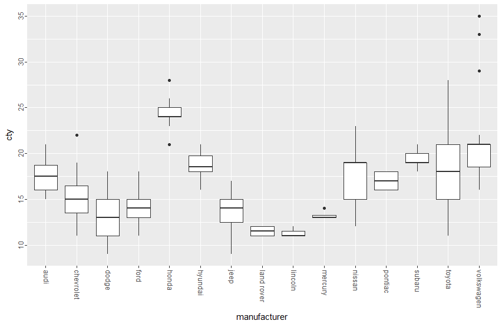
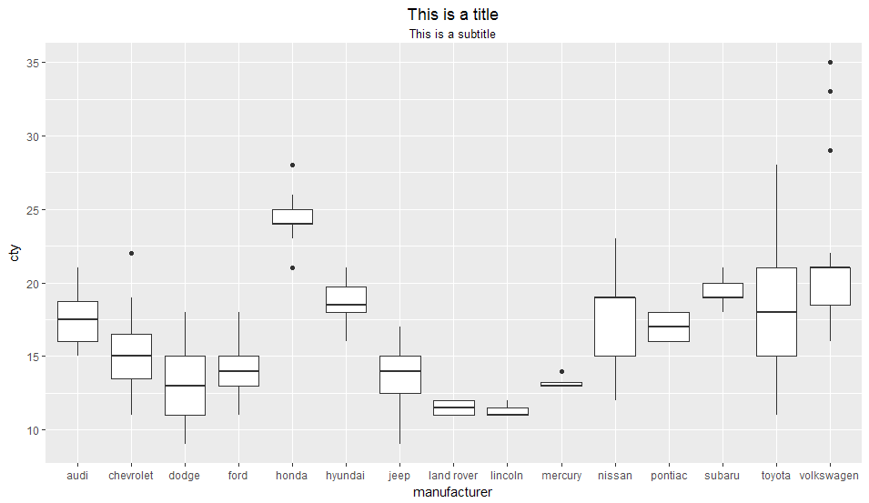

# desiderata

Desiderata is a personal package with a bunch o' functions that I (Desi) have collected or 
written as I needed them.

## Installation

``` r
install.packages("devtools")

devtools::install_github("DesiQuintans/desiderata")

library(desiderata)
```

## Project participants

-   Desi Quintans (<https://twitter.com/eco_desi>)

Please note that this project is released with a 
[Contributor Code of Conduct](CONDUCT.md). By participating in this project you agree to 
abide by its terms.


------------------------------------------------------------------------------------------

## Functions included

- **Dataframe functions**
    - Find and mark the longest run of TRUEs in a boolean vector (`mark_longest_run()` - [example](#find-and-mark-the-longest-run-of-trues-in-a-boolean-vector))
    - Mark the location of the last maximum value (peak) in a vector (`mark_last_peak()` - [example](#mark-the-location-of-the-last-maximum-value-peak-in-a-vector))
    - Replace all matching values in a dataframe with something else (`overwrite_df()` - [example](#replace-all-matching-values-in-a-dataframe-with-something-else))
    - Drop 'empty' columns in a dataframe (`drop_empty_cols()` - [example](#drop-empty-columns-in-a-dataframe))
    - Drop 'empty' rows in a dataframe (`drop_empty_rows()` - [example](#drop-empty-rows-in-a-dataframe))
    - Collapse a dataframe into a vector (`collapse_df()` - [example](#collapse-a-dataframe-into-a-vector))
    
- **File system functions**
    - Load an RDS file and announce when it was created (`loadRDS()` - [example](#load-an-rds-file-and-announce-when-it-was-created))
    - Build a path, creating subfolders if needed (`make_path()` - [example](#build-a-path-creating-subfolders-if-needed))
    - Apply a function to every file in a folder that matches a regex pattern (`apply_to_files()` - [example](#apply-a-function-to-every-file-in-a-folder-that-matches-a-regex-pattern))
    
- **Number functions**
    - Find the mode(s) of a numeric/character/factor vector (`Mode()` - [example](#find-the-modes-of-a-numericcharacterfactor-vector))
    - Geometric mean of a vector (`geomean()` - [example](#geometric-mean-of-a-vector))
    - Round a number to a fixed decimal place length (`round_to_places()` - [example](#round-a-number-to-a-fixed-decimal-place-length))
    - Round numbers to the nearest "pretty" value (`round_to_nearest()` - [example](#round-numbers-to-the-nearest-pretty-value))
    - Seed the random number generator with a character string (or any object) (`set.seed.any()` - [example](#seed-the-random-number-generator-with-a-character-string-or-any-object))
    - Calculate degree-days (`degreedays()` - [example](#calculate-degree-days))
    - Normalise a matrix column-wise between 0 and 1 (`normalize_colwise()` - [example](#normalise-a-matrix-column-wise-between-0-and-1))
    - Normalise a whole matrix between 0 and 1 (`normalize_whole()` - [example](#normalise-a-whole-matrix-between-0-and-1))
    - Concatenate numbers together (`concat_nums()` - [example](#concatenate-numbers-together))
    - Quick percentile overview (`percentile()` - [example](#quick-percentile-overview))
    
- **Plotting functions**
    - Desi's `ggplot2` minimal base theme (`theme_desi_base()` - [example](#desis-ggplot2-minimal-base-theme))
    - A palette of 1,022 visually-distinct colours (`palette_distinct()` - [example](#a-palette-of-1022-visually-distinct-colours))
    - Rotate and align ggplot2 axis tick labels (`rotate_x_text()` and `rotate_y_text()` - [example](#rotate-and-align-ggplot2-axis-tick-labels))
    - Horizontally align ggplot2 title and subtitle (`align_titles()` - [example](#horizontally-align-ggplot2-title-and-subtitle))
    
- **Datetime tools**
    - Find the current month number relative to a starting date (`consecutive_month()` - [example](#find-the-current-month-number-relative-to-a-starting-date))
    
- **String tools**
    - Collapse vectors into a regex pattern (`vec_to_regex()` - [example](#collapse-vectors-into-a-regex-pattern))
    
- **R tools**
    - Suppress all console printing (`cat`, `print`, `warning`, `message`) (`shush()` - [example](#suppress-all-console-printing-cat-print-warning-message))
    - Flag vector elements that are not in another vector (inverse of `%in%`) (`%notin%` - [example](#flag-vector-elements-that-are-not-in-another-vector-inverse-of-in))
    - Percentage of matching elements between two vectors (`%pctin%` - [example](#percentage-of-matching-elements-between-two-vectors))
    - Print to console, wrapping the text to a specific line width (`cat_wrap()` - [example](#print-to-console-wrapping-the-text-to-a-specific-line-width))
    - Copy a dataframe, vector, or the result of an expression to the clipboard (`clippy()` - [example](#copy-a-dataframe-vector-or-the-result-of-an-expression-to-the-clipboard))

## Data included

- The names of 197 common colours: red, green, cyan, etc. (`data(basic_color_names)` - [example](#the-names-of-197-common-colours-red-green-cyan-etc))

------------------------------------------------------------------------------------------

## Dataframe functions

### Find and mark the longest run of TRUEs in a boolean vector

``` r
x <- c(T,    T,    F,    F,    F,    F,    F,     T,    T,    T,    T,    T,    T,   F)
mark_longest_run(x)

#> [1] FALSE FALSE FALSE FALSE FALSE FALSE FALSE  TRUE  TRUE  TRUE  TRUE  TRUE  TRUE FALSE
```

### Mark the location of the last maximum value (peak) in a vector

``` r
input <- c(1, 2, 3, 3, 1)
mark_last_peak(input, threshold = NULL)

#> [1] FALSE FALSE FALSE  TRUE FALSE

mark_last_peak(input, threshold = 4)

#> [1] FALSE FALSE FALSE FALSE FALSE
```

### Replace all matching values in a dataframe with something else

By default, it will replace "empty" cells (cells with only `NA`, empty strings, spaces, 
or dashes) with an empty string. This is great for blanking out unwanted values for 
display in an Rmarkdown document.

``` r
test_df <-
    data.frame(stringsAsFactors = FALSE,
               name = c("insect1", "insect2", "insect3", "insect4", "insect5",
                        "insect6", "insect7", "insect8", "insect9", "insect10"),
               family = c("Belidae", "Belidae", " ", "Coccinelidae", NA, "Coccinelidae",
                          "Braconidae", "_", "-", "Curculionidae"),
               is_cool = c("TRUE", "TRUE", NA, "TRUE", "", "TRUE", "TRUE", "-", "_",
                           "TRUE")
    )

test_df

#>        name        family is_cool
#> 1   insect1       Belidae    TRUE
#> 2   insect2       Belidae    TRUE
#> 3   insect3                  <NA>
#> 4   insect4  Coccinelidae    TRUE
#> 5   insect5          <NA>        
#> 6   insect6  Coccinelidae    TRUE
#> 7   insect7    Braconidae    TRUE
#> 8   insect8             _       -
#> 9   insect9             -       _
#> 10 insect10 Curculionidae    TRUE

overwrite_df(test_df)

#>        name        family is_cool
#> 1   insect1       Belidae    TRUE
#> 2   insect2       Belidae    TRUE
#> 3   insect3                      
#> 4   insect4  Coccinelidae    TRUE
#> 5   insect5                      
#> 6   insect6  Coccinelidae    TRUE
#> 7   insect7    Braconidae    TRUE
#> 8   insect8                      
#> 9   insect9                      
#> 10 insect10 Curculionidae    TRUE
```

### Drop 'empty' columns in a dataframe

A column is empty when every single row is `NA`, `NULL`, `""`, or `0`.

``` r
data <- data.frame(a = c(1, 2, 3),
                b = c(0, 0, 0),
                c = c(1, 1, 0),
                d = c("", "", ""),
                e = c("moo", "baa", "woof"))
                
#> a b c d    e
#> 1 0 1    moo
#> 2 0 1    baa
#> 3 0 0    woof

drop_empty_cols(data)

#> a c    e
#> 1 1  moo
#> 2 1  baa
#> 3 0 woof
```

### Drop 'empty' rows in a dataframe

A column is empty when every single cell is `NA`, `NULL`, `""`, or `0`.

``` r
data <- data.frame(name = c("Jim", "Jane", "Janice", "Joe", "Jay"),
                   a = c(0, 0, 1, NA, 0),
                   b = c(1, "", 1, NA, 0),
                   c = c(1, 0, 2, 0, 0),
                   d = c(0, 0, 4, 0, 0),
                   e = c(0, 0, 5, 0, 0),
                   f = c(3, 0, 0, 0, 3),
                   stringsAsFactors = FALSE)

data

#>           1  2    3 4 5 6 7
#> 
#>        name  a    b c d e f
#> 1       Jim  0    1 1 0 0 3
#> 2      Jane  0      0 0 0 0
#> 3    Janice  1    1 2 4 5 0
#> 4       Joe NA <NA> 0 0 0 0
#> 5       Jay  0    0 0 0 0 3

drop_empty_rows(data)

# Returns the whole dataframe because column 1 ('name') is never empty.
#>        name  a    b c d e f
#> 1       Jim  0    1 1 0 0 3
#> 2      Jane  0      0 0 0 0
#> 3    Janice  1    1 2 4 5 0
#> 4       Joe NA <NA> 0 0 0 0
#> 5       Jay  0    0 0 0 0 3

drop_empty_rows(data, from = 2)

# We get the desired result when 'name' is omitted.
#>        name  a  b c d e f
#> 1       Jim  0  1 1 0 0 3
#> 3    Janice  1  1 2 4 5 0
#> 5       Jay  0  0 0 0 0 3

drop_empty_rows(data, cols = c(2, 5, 6))

# Non-contiguous columns can be selected with 'cols'.
#>        name  a  b c d e f
#> 3    Janice  1  1 2 4 5 0
```

### Collapse a dataframe into a vector

Useful for taking every number in a table and plotting it in a histogram, for example.

``` r
collapse_df(iris, cols = 1:4)

#> [1] 5.1 4.9 4.7 4.6 5.0 5.4 4.6 5.0 4.4 4.9 5.4 4.8 ...
```

## File system functions

### Load an RDS file and announce when it was created

``` r
data <- loadRDS("path", "to", "data.rds")

#> Loading data.rds
#> It was compiled on 2018-05-16 11:36:05.
```

### Build a path, creating subfolders if needed

``` r
make_path("path", "to", "subfolder")

#> [1] "path/to/subfolder"

# And the path/to/subfolder/ folders were also created in the working directory.

saveRDS(iris, make_path("subfolders/to/compiled/data/iris.rds"))

# Writes iris.rds, creating the folders leading to it if they don't already exist.
```

### Apply a function to every file in a folder that matches a regex pattern

``` r
rain <- apply_to_files(path = "Raw data/Rainfall", pattern = "csv", 
                       func = readr::read_csv, col_types = "Tiic", 
                       recursive = FALSE, ignorecase = TRUE, 
                       method = "row_bind")

dplyr::sample_n(rain, 5)

#> # A tibble: 5 x 5
#> 
#>   orig_source_file       Time                 Tips    mV Event 
#>   <chr>                  <dttm>              <int> <int> <chr> 
#> 1 BOW-BM-2016-01-15.csv  2015-12-17 03:58:00     0  4047 Normal
#> 2 BOW-BM-2016-01-15.csv  2016-01-03 00:27:00     2  3962 Normal
#> 3 BOW-BM-2016-01-15.csv  2015-11-27 12:06:00     0  4262 Normal
#> 4 BIL-BPA-2018-01-24.csv 2015-11-15 10:00:00     0  4378 Normal
#> 5 BOW-BM-2016-08-05.csv  2016-04-13 19:00:00     0  4447 Normal
```

## Number functions

### Find the mode(s) of a numeric/character/factor vector

``` r
vec <- c(1, 2, 3, 4, 4, 4, 3, 3, NA, NA, NA)

Mode(vec)
#> [1]  3  4 NA

Mode(vec, na.rm = TRUE)
#> [1] 3 4

Mode(vec, na.rm = FALSE, mean = TRUE)
#> [1] NA

Mode(vec, na.rm = TRUE, mean = TRUE)
#> [1] 3.5

Mode(1:4)
#> [1] 1 2 3 4

Mode(1:4, ties = FALSE)
#> [1] 1

Mode(1:4, mean = TRUE)
#> [1] 2.5
```

### Geometric mean of a vector

``` r
vec <- c(1, 3, 9, 27, 81, 243, 729)

mean(vec)
#> [1] 156.1429

geomean(vec)
#> [1] 27
```
### Round a number to a fixed decimal place length

``` r
vec <- c(1.739006, 2, -1.4, 1.05, 1.90, 3.826)
rounded_vec <- round_to_places(vec, 2)

str(rounded_vec)
#> chr [1:6] "1.70" "2.00" "-1.40" "1.00" "1.90" "3.80"
```

### Round numbers to the nearest "pretty" value

``` r
vec <- c(1.739006, 2, -1.4, 1.05, 1.90, 3.826)
round_to_nearest(vec, 0.5)

#> [1]  1.5  2.0 -1.5  1.0  2.0  4.0
```

### Seed the random number generator with a character string (or any object)

``` r
set_seed_any("Snake... Do you think love can bloom, even on a battlefield?")

set_seed_any(iris)
```

### Calculate degree-days

``` r
degreedays(min = c(19, 20, 20, 21), 
           max = c(25, 24, 23, 22), 
           base = 22, 
           method = "modavg")

#> [1] 1.5 1.0 0.5 0.0
```

### Normalise a matrix column-wise between 0 and 1

``` r
normalize_colwise(matrix(1:12, ncol = 3))

#>      [,1]  [,2]      [,3]
#> [1,] 0.25 0.625 0.7500000
#> [2,] 0.50 0.750 0.8333333
#> [3,] 0.75 0.875 0.9166667
#> [4,] 1.00 1.000 1.0000000
```

### Normalise a whole matrix between 0 and 1

``` r
mat <- matrix(1:4, ncol = 2)

#>      [,1] [,2]
#> [1,]    1    3
#> [2,]    2    4

normalize_whole(mat, from_zero = TRUE)

#>      [,1] [,2]
#> [1,] 0.25 0.75
#> [2,] 0.50 1.00

normalize_whole(mat, from_zero = FALSE)

#>           [,1]      [,2]
#> [1,] 0.0000000 0.6666667
#> [2,] 0.3333333 1.0000000
```

### Concatenate numbers together

``` r
concat_nums(12, "76", NA, 1.5)

#> [1] 127601.5
```

### Quick percentile overview

This is an alias of `stats::quantile()` with some useful default percentile values.

``` r
# round(runif(20, min = 0, max = 29))
vec <- c(28, 23, 3, 28, 6, 5, 21, 19, 9, 17, 22, 23, 26, 9, 5, 20, 19, 24, 3, 27)

perc <- percentile(vec)
perc

#>   0%   10%   20%   25%   33%   50%   66%   75%   80%   85%   90%   95%   99%  100%
#> 3.00  4.80  5.80  8.25 11.16 19.50 22.54 23.25 24.40 26.15 27.10 28.00 28.00 28.00

perc["66%"]

#>   66%
#> 22.54
```

## Plotting functions

### Desi's `ggplot2` minimal base theme

``` r
ggplot(iris, aes(x = Petal.Length, y = Sepal.Length)) + geom_point() + theme_desi_base()
```


### A palette of 1,022 visually-distinct colours

``` r
# To see all of the colours (ordered left-to-right and top-to-bottom):
image(apply(matrix(1022:1, ncol = 73, nrow = 14, byrow = TRUE), 1, rev), col = palette_distinct())

# To get the first 4 colours:
palette_distinct(4)

#> [1] "#000000" "#FFFF00" "#1CE6FF" "#FF34FF"

# To pick 4 colours randomly:
palette_distinct(4, random = TRUE)

#> [1] "#2F2E2C" "#DFE3E6" "#5C424D" "#FFE47D"
```


### Rotate and align ggplot2 axis tick labels

``` r 
library(ggplot2)

ggplot(mpg, aes(manufacturer, cty)) + 
    geom_boxplot() +
    rotate_x_text() +
    rotate_y_text()
```


### Horizontally align ggplot2 title and subtitle

``` r 
library(ggplot2)

ggplot(mpg, aes(manufacturer, cty)) + geom_boxplot() +
    labs(title = "This is a title", subtitle = "This is a subtitle") +
    align_titles(align = 0.5)
```


## Datetime tools

### Find the current month number relative to a starting date

``` r
# These are the same thing.

consecutive_month("2015-01-01", "2016-02-04")
consecutive_month(2015,         "2016-02-04")
#> [1] 14

consecutive_month("2015-02-01", "2016-02-04")
#> [1] 13
```

## String tools

### Collapse vectors into a regex pattern

``` r
vec_to_regex(month.abb)

#> [1] "(Jan|Feb|Mar|Apr|May|Jun|Jul|Aug|Sep|Oct|Nov|Dec)"

vec_to_regex(letters[1:6], sep = "", wrap = c("([", "]+)"))

#> [1] "([abcdef]+)"
```

## R tools

### Suppress all console printing (`cat`, `print`, `warning`, `message`)

Ideal for use in Rmarkdown documents if, for example, the functions in a package print unwanted debug messages using `cat()` or `print()`, which can't be suppressed with `suppressWarnings()` or `suppressMessages()`.

``` r
loud_mean <- function(x) {
    print("This is from print().")
    cat("This is from cat().\n")
    message("This is from message().")
    warning("This is from warning().")
    mean(x)
}

loud_mean(1:100)

#> [1] "This is from print()."
#> This is from cat().
#> This is from message().
#> [1] 50.5
#> Warning message:
#>     In loud_mean(1:100) : This is from warning().

shush(loud_mean(1:100))

#> [1] 50.5

# Any expression will work.
shush(loud_mean(1:100) %>% sqrt())

#> [1] 7.106335
```

### Flag vector elements that are not in another vector (inverse of `%in%`)

In base R, you find the opposite of `%in%` by negating it like `!(x %in% y)`. `%notin%` is simply `!(x %in% y)` in a more readable form.

``` r
c(1, 4, 21, 7, -3) %in% 0:10
#> [1]  TRUE  TRUE FALSE  TRUE FALSE

c(1, 4, 21, 7, -3) %notin% 0:10
#> [1] FALSE FALSE  TRUE FALSE  TRUE
```

### Percentage of matching elements between two vectors

``` r
c(1, 4, 21, 7, -3) %in% 0:10
#> [1]  TRUE  TRUE FALSE  TRUE FALSE

c(1, 4, 21, 7, -3) %pctin% 0:10
#> [1] 0.6
```

### Print to console, wrapping the text to a specific line width

Wrapping console output is essential in Rmarkdown documents because long character vectors do not wrap when printed inside code blocks.

``` r
vec <- c("This is a very long chunk of text.",
         "This is also another quite long chunk of text.")

cat_wrap(vec, width = 25)

#> This is a very long
#> chunk of text.
#>
#> This is also another
#> quite long chunk of
#> text.
```

### Copy a dataframe, vector, or the result of an expression to the clipboard

``` r
clippy(mtcars)

# Clipboard contents:
# mpg  cyl disp  hp   drat  wt     qsec   vs  am  gear  carb
# 21   6   160   110  3.9   2.62   16.46  0   1   4     4
# 21   6   160   110  3.9   2.875  17.02  0   1   4     4
# ...

clippy(iris$Petal.Length)

# Clipboard contents:
# 1.4
# 1.4
# 1.3
# ...

clippy(colnames(iris))

# Clipboard contents:
# Sepal.Length
# Sepal.Width
# Petal.Length
# Petal.Width
# Species
```

## Data included

### The names of 197 common colours: red, green, cyan, etc.

One day I wanted to mine botanical descriptions to get the colours of flowers, so I needed a list of colour names to match to. I decided to use the agreed-upon names for browser-compatible web colours, which spans a range of specificity from "red" to "light goldenrod yellow". I sourced these names from:

- <https://simple.wikipedia.org/wiki/Web_color>
- <https://simple.wikipedia.org/wiki/List_of_colors>

This is a character vector of names, lowercased and sorted by word length so that common colours like red and blue come earlier in the list.

``` r
data(basic_color_names)
data(basic_colour_names)

print(basic_color_names)

#>   [1] "red"                    "tan"                    "aqua"
#>   [4] "blue"                   "cyan"                   "erin"
#>   [7] "gold"                   "gray"                   "grey"
#>  [10] "jade"                   "lime"                   "navy"
#>  [13] "pear"                   "peru"                   "pink"
#>  [16] "plum"                   "puce"                   "rose"
#>  [19] "ruby"                   "snow"                   "teal"
#>  [22] "amber"                  "azure"                  ...
```
