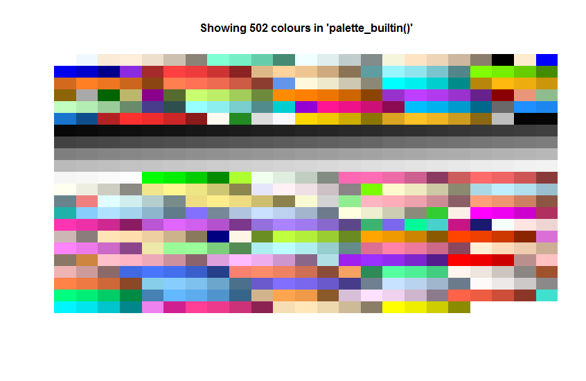

# desiderata

Desiderata is a personal package with a bunch o' functions that I (Desi) have collected or written as I needed them.

## Installation

``` r
install.packages("remotes")

remotes::install_github("DesiQuintans/desiderata")

library(desiderata)
```

## Project participants

-   Desi Quintans (<https://twitter.com/eco_desi>)

Please note that this project is released with a [Contributor Code of Conduct](CONDUCT.md). By participating in this project you agree to abide by its terms.

------------------------------------------------------------------------

# Functions

-   `desiderata::`
    -   Tools for interactive programming
        -   `ensure()` --- Quick assertion function for QA checks on code (e.g. checking that a dataframe has the same number of rows before and after a join)
        -   `sift()` --- Fuzzily search column names and labels and get basic summary statistics about them
        -   `Show()` --- Pipeline- and knit-friendly `View()`
        -   `clippy()` --- Copy a dataframe, vector, or the result of an expression to the clipboard
        -   `try.seed()` --- Generate random seeds to preview their effects
        -   `coinflip()` --- Randomly return `TRUE` or `FALSE`
    -   Functions that work on many different types of data
        -   `Mode()` --- Find the mode(s) of a numeric/character/factor vector
        -   `na_rm()` --- Remove `NA` from vectors, lists, matrices, and dataframes
        -   `howmany()` --- Count the number of unique elements
        -   `count_unique()` --- Count how many times each unique element in a vector is repeated
        -   `unique_n()` --- Keep the first `n` unique elements in a vector
        -   `keep_every()` --- Keep every other element of a vector, flexibly
        -   `assign_groups()` --- Assign elements in a vector to groups
        -   `split_size()` --- Split a vector into chunks of size `n`
        -   `%notin%` --- Flag vector elements that are **not** in another vector (inverse of `%in%`)
        -   `%pctin%` --- Percentage of matching elements between two vectors
        -   `not.na()` --- Opposite of `is.na()`
        -   `not.nan()` --- Opposite of `is.nan()`
        -   `if_na()` --- Alias for `ifelse(is.na(x), yes = TRUE, no = x)`.
        -   `fold()` --- Friendly printing of multi-item vectors, e.g. `"Jan, Feb, and 10 others"`.
        -   `anyFalse()` --- Alias of `any(!(...))` (note: it's different from `!any(...)`)
        -   `report_diff()` --- Are these two vectors exactly the same? What pairwise elements are mismatched, and how many?
    -   Dataframe functions
        -   `overwrite_df()` --- Replace all matching values in a dataframe with something else
        -   `drop_empty_cols()` --- Drop 'empty' columns in a dataframe (plus regex matching)
        -   `drop_empty_rows()` --- Drop 'empty' rows in a dataframe (plus regex matching)
        -   `collapse_df()` --- Collapse a dataframe's cells into a single vector
        -   `sort_cols()` --- Sort columns of a dataframe by name
        -   `drop_invar_cols()` --- Drop invariant columns from a dataframe
        -   `top_tail()` --- First and last rows of a dataframe
        -   `add_group_size()` --- Add group size as a column
        -   `rows_with_na()` --- Only keep rows that contain `NA`
        -   `same_cols()` --- Given two dataframes, which columns appear in both of them?
        -   `diff_cols()` --- Given two dataframes, which columns are present in one but not in the other?
        -   `na_in_row()` --- Gives the count/proportion of `NA` for each row of a dataframe, using `dplyr` tidyselectors (`-`, `:`, `starts_with()`, etc.) to choose which columns to look at.
    -   Number functions
        -   `round_to_nearest()` --- Round numbers to the nearest "pretty" value (e.g. nearest `0.1`)
        -   `round_to()` --- Round numbers to a fixed number of decimal places and return them as `Numeric`
        -   `normalize_colwise()` --- Normalise a matrix column-wise between 0 and 1
        -   `normalize_whole()` --- Normalise a whole matrix between 0 and 1
        -   `concat_nums()` --- Concatenate a numeric vector into a single number
        -   `mirror_matrix()` --- Mirror a matrix horizontally
        -   `is.prime()` --- Is a number prime?
        -   `encode_signif()` --- Replace p-values with significance codes
        -   `mark_longest_run()` --- Find and mark the longest run of TRUEs in a boolean vector
        -   `mark_last_peak()` --- Mark the location of the last maximum value (peak) in a vector
        -   `omit_dips()` --- Replace element with `NA` if it is less than the elements before and after it
        -   `is.flanked()` --- Is a vector element surrounded by certain values?
        -   `cut_int()` --- Cut an integer into `n` exclusive chunks, e.g. chunk 1 gets rows 1-10, chunk 2 gets rows 11-20, and so on.
    -   Specific calculations
        -   `geomean()` --- Geometric mean of a vector
        -   `se_mean()` --- Standard error of the mean
        -   `degreedays()` --- Calculate degree-days
        -   `percentile()` --- Quick percentile overview (plus plotting option)
        -   `cumpct()` --- Cumulative percentage
        -   `IQR_outliers()` --- Mark outliers in a vector according to the percentile method
        -   `triangle_num()` --- nth Triangle Number, like factorial but with addition
        -   `boot_ci_mean()` --- Bootstrapped confidence interval of the mean
        -   `instant_runoff_voting()` --- Instant run-off (ranked-choice) voting algorithm
    -   String functions
        -   `vec_to_regex()` --- Collapse vectors into a regex pattern
        -   `str_coll()` --- Collapse a vector into a single string
        -   `uw()` and `uw0()` --- "Unwrap" hard-wrapped strings into a single line
        -   `common_stem()` --- Return the stem that is common to a set of strings
        -   `str_rev()` --- Reverse the elements of a vector (e.g. make words go backwards) without changing the order of elements in the vector itself.
        -   `rev_sentence()` --- Reverse the order of words in a string
        -   `interleave()` --- Interleave one string with another
        -   `match_in_substr()` --- Match strings that have a needle near the start, end, or middle
    -   Datetime functions
        -   `consecutive_month()` --- Find the current month number relative to a starting date
        -   `consecutive_week()` --- Find the number of weeks or isoweeks between two dates
        -   `round_to_duration()` --- Round a duration of days to other units (e.g. weeks, months).
    -   Plotting functions
        -   `show_colours()` --- Plot colours as tiles
        -   `build_palette()` --- Manipulate a list of hex colours
            -   `palette_builtin()` --- A palette of R's 502 distinct built-in colours
            -   `palette_distinct()` --- A palette of 1,022 visually-distinct colours
            -   `palette_mrmrs()` --- A palette of Adam Morse's 16 web-safe colours
            -   `palette_picked()` --- A palette of 14 hand-picked distinct colours
        -   `plot_arrange()` --- Arrange base R plots on a grid
        -   `rcols_as_hex()` --- Convert R's built-in named colours to hex codes
        -   `col2hsv()` --- Convert hex colours to HSV
        -   `quick_lm()` --- Fit and plot a two-term linear model quickly
        -   `theme_desi_base()` --- Desi's `ggplot2` minimal base theme
        -   `align_titles()` --- Horizontally align ggplot2 title and subtitle
        -   `rotate_x_text()` and `rotate_y_text()` --- Rotate and align ggplot2 axis tick labels
        -   `rotate_x_facet_text()` and `rotate_y_facet_text()` --- Rotate and align ggplot2 facet labels
        -   `dendro()` --- Print a dendrogram
    -   File system functions
        -   `loadRDS()` --- Load an RDS file and announce when it was created
        -   `make_path()` --- Build a path, creating subfolders if needed
        -   `apply_to_files()` --- Apply a function to every file in a folder that matches a regex pattern
        -   `write_csv_rds()` --- Write a dataframe to a CSV and RDS
        -   `save_a4()` --- Save a ggplot as an A4 image
    -   Miscellaneous functions
        -   `shush()` --- Suppress all console printing (`cat`, `print`, `warning`, `message`)
        -   `cat_wrap()` --- Print to console, wrapping the text to a specific line width
        -   `dots_char()` --- Convert dots to a character vector or a string
        -   `set_seed_any()` --- Seed the random number generator with a character string (or any object)
    -   Data included
        -   `basic_color_names` --- The names of 197 common colours: red, green, cyan, etc.
        -   `random_integers` --- 10,000 random integers between 0 and 100
        -   `iris_labelled` --- The `iris` dataset with a `label` attribute added, as `Hmisc` and other packages do.
        -   `nz_boty_2019_head` --- The first 1000 voters from the New Zealand Bird of the Year survey, 2019.

------------------------------------------------------------------------

# Included colour palettes

## A palette of R's 502 distinct built-in colours

``` r
show_colours(palette_builtin())
```



## A palette of 1,022 visually-distinct colours

Many of these are not colorblind safe, and many of them have low contrast or are very similar (but should still be different enough to discriminate when they are side-by-side).

``` r
show_colours(palette_distinct())
```


## A palette of Adam Morse's 16 web-safe colours

This is a palette by Adam Morse, sourced from <https://clrs.cc/>.

``` r
show_colours(palette_mrmrs())
```


## A palette of 14 hand-picked distinct colours {#a-palette-of-14-hand-picked-distinct-colours}

The palette created by `desiderata::palette_distinct()` has a lot of colours that are either so dark or so light that it's difficult to differentiate them next to each other. In addition, many of the colours are affected by adjacency effects, where they cannot be differentiated when they're next to a closely-related colour.

I went through the preview plots manually, randomising the order of the colours each time and deleting any colours that were visually similar until I ended up with a list of colours that were easy to differentiate.

``` r
show_colours(palette_picked())
```


## Desi's `ggplot2` minimal base theme

``` r
ggplot(iris, aes(x = Petal.Length, y = Sepal.Length)) + 
    geom_point() + 
    theme_desi_base()
```


