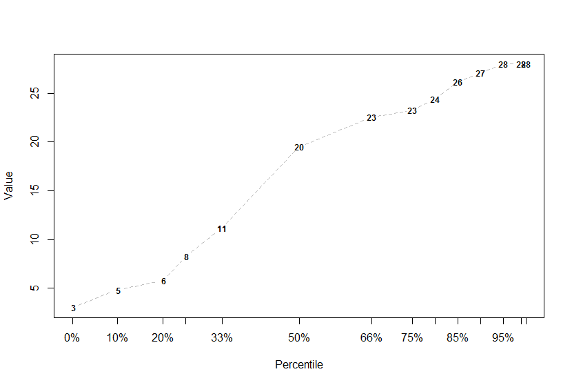

# desiderata

Desiderata is a personal package with a bunch o' functions that I (Desi) have collected or 
written as I needed them.

## Installation

``` r
install.packages("devtools")

devtools::install_github("DesiQuintans/desiderata")

library(desiderata)
```

## Project participants

-   Desi Quintans (<https://twitter.com/eco_desi>)

Please note that this project is released with a 
[Contributor Code of Conduct](CONDUCT.md). By participating in this project you agree to 
abide by its terms.


------------------------------------------------------------------------------------------

## Functions included

- **Generic functions**
    - Count the number of unique values (dataframe, table, vector) (`howmany()` - [example](#count-the-number-of-unique-values))

- **Dataframe functions**
    - Find and mark the longest run of TRUEs in a boolean vector (`mark_longest_run()` - [example](#find-and-mark-the-longest-run-of-trues-in-a-boolean-vector))
    - Mark the location of the last maximum value (peak) in a vector (`mark_last_peak()` - [example](#mark-the-location-of-the-last-maximum-value-peak-in-a-vector))
    - Replace all matching values in a dataframe with something else (`overwrite_df()` - [example](#replace-all-matching-values-in-a-dataframe-with-something-else))
    - Drop 'empty' columns in a dataframe (`drop_empty_cols()` - [example](#drop-empty-columns-in-a-dataframe))
    - Drop 'empty' rows in a dataframe (`drop_empty_rows()` - [example](#drop-empty-rows-in-a-dataframe))
    - Collapse a dataframe into a vector (`collapse_df()` - [example](#collapse-a-dataframe-into-a-vector))
    - Sort columns of a dataframe by name (`sort_cols()` - [example](#sort-columns-of-a-dataframe-by-name))
    - Drop invariant columns from a dataframe (`drop_invar_cols()` - [example](#drop-invariant-columns-from-a-dataframe))
    - First and last rows of a dataframe (`top_tail()` - [example](#first-and-last-rows-of-a-dataframe))
    
    
- **File system functions**
    - Load an RDS file and announce when it was created (`loadRDS()` - [example](#load-an-rds-file-and-announce-when-it-was-created))
    - Build a path, creating subfolders if needed (`make_path()` - [example](#build-a-path-creating-subfolders-if-needed))
    - Apply a function to every file in a folder that matches a regex pattern (`apply_to_files()` - [example](#apply-a-function-to-every-file-in-a-folder-that-matches-a-regex-pattern))
    
    
- **Number functions**
    - Find the mode(s) of a numeric/character/factor vector (`Mode()` - [example](#find-the-modes-of-a-numericcharacterfactor-vector))
    - Geometric mean of a vector (`geomean()` - [example](#geometric-mean-of-a-vector))
    - Standard error of the mean (`se_mean()` - [example](#standard-error-of-the-mean))
    - Round numbers to the nearest "pretty" value (`round_to_nearest()` - [example](#round-numbers-to-the-nearest-pretty-value))
    - Seed the random number generator with a character string (or any object) (`set_seed_any()` - [example](#seed-the-random-number-generator-with-a-character-string-or-any-object))
    - Calculate degree-days (`degreedays()` - [example](#calculate-degree-days))
    - Normalise a matrix column-wise between 0 and 1 (`normalize_colwise()` - [example](#normalise-a-matrix-column-wise-between-0-and-1))
    - Normalise a whole matrix between 0 and 1 (`normalize_whole()` - [example](#normalise-a-whole-matrix-between-0-and-1))
    - Concatenate numbers together (`concat_nums()` - [example](#concatenate-numbers-together))
    - Quick percentile overview (`percentile()` - [example](#quick-percentile-overview))
    - Mirror a matrix horizontally (`mirror_matrix()` - [example](#mirror-a-matrix-horizontally))
    - Count how many times each unique element in a vector is repeated (`count_unique()` - [example](#count-how-many-times-each-unique-element-in-a-vector-is-repeated))
    - Is a number prime? (`is.prime()` - [example](#is-a-number-prime))
    - Divide a vector into groups (`split_n` - [example](#divide-a-vector-into-groups))
    
    
- **Plotting functions**
    - Desi's `ggplot2` minimal base theme (`theme_desi_base()` - [example](#desis-ggplot2-minimal-base-theme))
    - Fit and plot a two-term linear model quickly (`quick_lm()` - [example](#fit-and-plot-a-two-term-linear-model-quickly))
    - Arrange base R plots on a grid (`plot_arrange()` - [example](#arrange-base-r-plots-on-a-grid))
    - Plot colours as tiles (`show_colours()` - [example](#plot-colours-as-tiles))
    - Convert R's built-in named colours to hex codes (`rcols_as_hex()` - [example](#convert-rs-built-in-named-colours-to-hex-codes))
    - Manipulate a list of hex colours (`build_palette()` - [example](#manipulate-a-list-of-hex-colours))
    - A palette of R's 502 distinct built-in colours (`palette_builtin()` - [example](#a-palette-of-rs-502-distinct-built-in-colours))
    - A palette of 1,022 visually-distinct colours (`palette_distinct()` - [example](#a-palette-of-1022-visually-distinct-colours))
    - A palette of Adam Morse's 16 web-safe colours (`palette_mrmrs()` - [example](#a-palette-of-adam-morses-16-web-safe-colours))
    - A palette of 14 hand-picked distinct colours (`palette_picked()` - [example](#a-palette-of-14-hand-picked-distinct-colours))
    - Rotate and align ggplot2 axis tick labels (`rotate_x_text()` and `rotate_y_text()` - [example](#rotate-and-align-ggplot2-axis-tick-labels))
    - Horizontally align ggplot2 title and subtitle (`align_titles()` - [example](#horizontally-align-ggplot2-title-and-subtitle))
    - Rotate and align ggplot2 facet labels (`rotate_x_facet_text()` and `rotate_y_facet_text()` - [example](#rotate-and-align-ggplot2-facet-labels))
    
    
- **Datetime tools**
    - Find the current month number relative to a starting date (`consecutive_month()` - [example](#find-the-current-month-number-relative-to-a-starting-date))
    
    
- **String tools**
    - Collapse vectors into a regex pattern (`vec_to_regex()` - [example](#collapse-vectors-into-a-regex-pattern))
    - Collapse a vector into a string (`collapse_vec()` - [example](#collapse-a-vector-into-a-string))
    - "Unwrap" hard-wrapped strings into a single line (`uw()` - [example](#unwrap-hard-wrapped-strings-into-a-single-line))
    - Return the stem that is common to a set of strings (`common_stem()` [example](#return-the-stem-that-is-common-to-a-set-of-strings))
    - Reverse the elements in a vector (`str_rev()` [example](#reverse-the-elements-in-a-vector))
    - Get the nth word from a string (`nth_word()` [example](#get-the-nth-word-from-a-string))
    
    
- **R tools**
    - Suppress all console printing (`cat`, `print`, `warning`, `message`) (`shush()` - [example](#suppress-all-console-printing-cat-print-warning-message))
    - Flag vector elements that are not in another vector (inverse of `%in%`) (`%notin%` - [example](#flag-vector-elements-that-are-not-in-another-vector-inverse-of-in))
    - Percentage of matching elements between two vectors (`%pctin%` - [example](#percentage-of-matching-elements-between-two-vectors))
    - Print to console, wrapping the text to a specific line width (`cat_wrap()` - [example](#print-to-console-wrapping-the-text-to-a-specific-line-width))
    - Copy a dataframe, vector, or the result of an expression to the clipboard (`clippy()` - [example](#copy-a-dataframe-vector-or-the-result-of-an-expression-to-the-clipboard))
    - Randomly return `TRUE` or `FALSE` (`coinflip()` - [example](#randomly-return-true-or-false))
    - Generate random seeds to preview their effects (`try.seed()` - [example](#generate-random-seeds-to-preview-their-effects))

## Data included

- The names of 197 common colours: red, green, cyan, etc. (`data(basic_color_names)` - [example](#the-names-of-197-common-colours-red-green-cyan-etc))


------------------------------------------------------------------------------------------


## Generic functions

### Count the number of unique values

``` r
## --- Default method ---

howmany(rep(letters, 3))
#> 26

howmany(letters, LETTERS)
#> 52


## --- Data.frame method ---

howmany(mtcars)

#> mpg cyl disp hp drat wt qsec vs am gear carb
#>  25   3   27 22   22 29   30  2  2    3    6

howmany(mtcars, -(mpg:disp))

#> hp drat wt qsec vs am gear carb
#> 22   22 29   30  2  2    3    6

howmany(mtcars, drat)

#> drat
#>   22


## --- Table method ---

class(Titanic)
#> [1] "table"

howmany(Titanic)

#> Class Sex Age Survived Freq
#>     4   2   2        2   22
```


## Dataframe functions

### Find and mark the longest run of TRUEs in a boolean vector

``` r
x <- c(T,    T,    F,    F,    F,    F,    F,     T,    T,    T,    T,    T,    T,   F)
mark_longest_run(x)

#> [1] FALSE FALSE FALSE FALSE FALSE FALSE FALSE  TRUE  TRUE  TRUE  TRUE  TRUE  TRUE FALSE
```

### Mark the location of the last maximum value (peak) in a vector

``` r
input <- c(1, 2, 3, 3, 1)
mark_last_peak(input, threshold = NULL)

#> [1] FALSE FALSE FALSE  TRUE FALSE

mark_last_peak(input, threshold = 4)

#> [1] FALSE FALSE FALSE FALSE FALSE
```

### Replace all matching values in a dataframe with something else

By default, it will replace "empty" cells (cells with only `NA`, empty strings, spaces, 
or dashes) with an empty string. This is great for blanking out unwanted values for 
display in an Rmarkdown document.

``` r
test_df <-
    data.frame(stringsAsFactors = FALSE,
               name = c("insect1", "insect2", "insect3", "insect4", "insect5",
                        "insect6", "insect7", "insect8", "insect9", "insect10"),
               family = c("Belidae", "Belidae", " ", "Coccinelidae", NA, "Coccinelidae",
                          "Braconidae", "_", "-", "Curculionidae"),
               is_cool = c("TRUE", "TRUE", NA, "TRUE", "", "TRUE", "TRUE", "-", "_",
                           "TRUE")
    )

test_df

#>        name        family is_cool
#> 1   insect1       Belidae    TRUE
#> 2   insect2       Belidae    TRUE
#> 3   insect3                  <NA>
#> 4   insect4  Coccinelidae    TRUE
#> 5   insect5          <NA>        
#> 6   insect6  Coccinelidae    TRUE
#> 7   insect7    Braconidae    TRUE
#> 8   insect8             _       -
#> 9   insect9             -       _
#> 10 insect10 Curculionidae    TRUE

overwrite_df(test_df)

#>        name        family is_cool
#> 1   insect1       Belidae    TRUE
#> 2   insect2       Belidae    TRUE
#> 3   insect3                      
#> 4   insect4  Coccinelidae    TRUE
#> 5   insect5                      
#> 6   insect6  Coccinelidae    TRUE
#> 7   insect7    Braconidae    TRUE
#> 8   insect8                      
#> 9   insect9                      
#> 10 insect10 Curculionidae    TRUE
```

### Drop 'empty' columns in a dataframe

A column is empty when every single row is `NA`, `NULL`, `""`, or `0`.

``` r
data <- data.frame(a = c(1, 2, 3),
                b = c(0, 0, 0),
                c = c(1, 1, 0),
                d = c("", "", ""),
                e = c("moo", "baa", "woof"))
                
#> a b c d    e
#> 1 0 1    moo
#> 2 0 1    baa
#> 3 0 0    woof

drop_empty_cols(data)

#> a c    e
#> 1 1  moo
#> 2 1  baa
#> 3 0 woof
```

### Drop 'empty' rows in a dataframe

A column is empty when every single cell is `NA`, `NULL`, `""`, or `0`.

``` r
data <- data.frame(name = c("Jim", "Jane", "Janice", "Joe", "Jay"),
                   a = c(0, 0, 1, NA, 0),
                   b = c(1, "", 1, NA, 0),
                   c = c(1, 0, 2, 0, 0),
                   d = c(0, 0, 4, 0, 0),
                   e = c(0, 0, 5, 0, 0),
                   f = c(3, 0, 0, 0, 3),
                   stringsAsFactors = FALSE)

data

#>           1  2    3 4 5 6 7
#> 
#>        name  a    b c d e f
#> 1       Jim  0    1 1 0 0 3
#> 2      Jane  0      0 0 0 0
#> 3    Janice  1    1 2 4 5 0
#> 4       Joe NA <NA> 0 0 0 0
#> 5       Jay  0    0 0 0 0 3

drop_empty_rows(data)

# Returns the whole dataframe because column 1 ('name') is never empty.
#>        name  a    b c d e f
#> 1       Jim  0    1 1 0 0 3
#> 2      Jane  0      0 0 0 0
#> 3    Janice  1    1 2 4 5 0
#> 4       Joe NA <NA> 0 0 0 0
#> 5       Jay  0    0 0 0 0 3

drop_empty_rows(data, from = 2)

# We get the desired result when 'name' is omitted.
#>        name  a  b c d e f
#> 1       Jim  0  1 1 0 0 3
#> 3    Janice  1  1 2 4 5 0
#> 5       Jay  0  0 0 0 0 3

drop_empty_rows(data, cols = c(2, 5, 6))

# Non-contiguous columns can be selected with 'cols'.
#>        name  a  b c d e f
#> 3    Janice  1  1 2 4 5 0
```

### Collapse a dataframe into a vector

Useful for taking every number in a table and plotting it in a histogram, for example.

``` r
collapse_df(iris, cols = 1:4)

#> [1] 5.1 4.9 4.7 4.6 5.0 5.4 4.6 5.0 4.4 4.9 5.4 4.8 ...
```

### Sort columns of a dataframe by name

Sorts the columns of a dataframe, and then allows you to pull columns to the start of the dataframe by name.

``` r
colnames(iris)
#> [1] "Sepal.Length" "Sepal.Width"  "Petal.Length" "Petal.Width"  "Species"

sorted <- sort_cols(iris)

colnames(sorted)
#> [1] "Petal.Length" "Petal.Width"  "Sepal.Length" "Sepal.Width"  "Species"

reverse <- sort_cols(iris, decreasing = TRUE)

colnames(reverse)
#> [1] "Species"  "Sepal.Width"  "Sepal.Length" "Petal.Width"  "Petal.Length"

manual <- sort_cols(iris, Species)

colnames(manual)
#> [1] "Species" " Petal.Length" "Petal.Width"  "Sepal.Length" "Sepal.Width"
```

### Drop invariant columns from a dataframe

Deletes columns from a dataframe if they do not vary. For `character` and `factor`
columns, this means that every row of the column contains exactly the same string.
For `numeric` columns, the numbers are rounded to a nearest common value (by default, 
the mean of the column) and then checked to see if every rounded number is the same.

``` r
df

#>   char_invar char_var num_invar num_mean_0 num_var
#> 1          A        A         1       0.00    0.00
#> 2          A        A         1      -0.10    0.20
#> 3          A        A         1       0.10    0.80
#> 4          A        B         1       0.01    0.03
#> 5          A        A         1      -0.01    0.40


drop_invar_cols(df)

#>   char_var num_var
#> 1        A    0.00
#> 2        A    0.20
#> 3        A    0.80
#> 4        B    0.03
#> 5        A    0.40
```


### First and last rows of a dataframe

``` r
top_tail(iris, top = 3, tail = 3)

#>     Sepal.Length Sepal.Width Petal.Length Petal.Width   Species
#> 1            5.1         3.5          1.4         0.2    setosa
#> 2            4.9         3.0          1.4         0.2    setosa
#> 3            4.7         3.2          1.3         0.2    setosa
#> 148          6.5         3.0          5.2         2.0 virginica
#> 149          6.2         3.4          5.4         2.3 virginica
#> 150          5.9         3.0          5.1         1.8 virginica
```


## File system functions

### Load an RDS file and announce when it was created

``` r
data <- loadRDS("path", "to", "data.rds")

#> Loading data.rds
#> It was compiled on 2018-05-16 11:36:05.
```

### Build a path, creating subfolders if needed

``` r
make_path("path", "to", "subfolder")

#> [1] "path/to/subfolder"

# And the path/to/subfolder/ folders were also created in the working directory.

saveRDS(iris, make_path("subfolders/to/compiled/data/iris.rds"))

# Writes iris.rds, creating the folders leading to it if they don't already exist.
```

### Apply a function to every file in a folder that matches a regex pattern

``` r
rain <- apply_to_files(path = "Raw data/Rainfall", pattern = "csv", 
                       func = readr::read_csv, col_types = "Tiic", 
                       recursive = FALSE, ignorecase = TRUE, 
                       method = "row_bind")

dplyr::sample_n(rain, 5)

#> # A tibble: 5 x 5
#> 
#>   orig_source_file       Time                 Tips    mV Event 
#>   <chr>                  <dttm>              <int> <int> <chr> 
#> 1 BOW-BM-2016-01-15.csv  2015-12-17 03:58:00     0  4047 Normal
#> 2 BOW-BM-2016-01-15.csv  2016-01-03 00:27:00     2  3962 Normal
#> 3 BOW-BM-2016-01-15.csv  2015-11-27 12:06:00     0  4262 Normal
#> 4 BIL-BPA-2018-01-24.csv 2015-11-15 10:00:00     0  4378 Normal
#> 5 BOW-BM-2016-08-05.csv  2016-04-13 19:00:00     0  4447 Normal
```

## Number functions

### Find the mode(s) of a numeric/character/factor vector

``` r
vec <- c(1, 2, 3, 4, 4, 4, 3, 3, NA, NA, NA)

Mode(vec)
#> [1]  3  4 NA

Mode(vec, na.rm = TRUE)
#> [1] 3 4

Mode(vec, break_ties = "mean", na.rm = FALSE)
#> [1] NA

Mode(vec, break_ties = "mean", na.rm = TRUE)
#> [1] 3.5

Mode(1:4)
#> [1] 1 2 3 4

Mode(1:4, break_ties = "random")
#> [1] 3
```

### Geometric mean of a vector

``` r
vec <- c(1, 3, 9, 27, 81, 243, 729)

mean(vec)
#> [1] 156.1429

geomean(vec)
#> [1] 27
```

### Standard error of the mean

The standard error of the mean is how the estimated mean changes with multiple
measurements (i.e. how far away the mean of each sampling event or observation is from
the true population mean). SE drops as sample size grows because as you take more
measurements, the sampling means cluster more closely to the true mean.

``` r
se_mean(c(1, 2, 3, 4, NA_integer_))
#> NA

se_mean(c(1, 2, 3, 4, NA_integer_), na.rm = TRUE)
#> [1] 0.6454972
```

### Round numbers to the nearest "pretty" value

``` r
vec <- c(1.739006, 2, -1.4, 1.05, 1.90, 3.826)
round_to_nearest(vec, 0.5)

#> [1]  1.5  2.0 -1.5  1.0  2.0  4.0
```

### Seed the random number generator with a character string (or any object)

``` r
set_seed_any("Snake... Do you think love can bloom, even on a battlefield?")

set_seed_any(iris)
```

### Calculate degree-days

``` r
degreedays(min = c(19, 20, 20, 21), 
           max = c(25, 24, 23, 22), 
           base = 22, 
           method = "modavg")

#> [1] 1.5 1.0 0.5 0.0
```

### Normalise a matrix column-wise between 0 and 1

``` r
normalize_colwise(matrix(1:12, ncol = 3))

#>      [,1]  [,2]      [,3]
#> [1,] 0.25 0.625 0.7500000
#> [2,] 0.50 0.750 0.8333333
#> [3,] 0.75 0.875 0.9166667
#> [4,] 1.00 1.000 1.0000000
```

### Normalise a whole matrix between 0 and 1

``` r
mat <- matrix(1:4, ncol = 2)

#>      [,1] [,2]
#> [1,]    1    3
#> [2,]    2    4

normalize_whole(mat, from_zero = TRUE)

#>      [,1] [,2]
#> [1,] 0.25 0.75
#> [2,] 0.50 1.00

normalize_whole(mat, from_zero = FALSE)

#>           [,1]      [,2]
#> [1,] 0.0000000 0.6666667
#> [2,] 0.3333333 1.0000000
```

### Concatenate numbers together

``` r
concat_nums(12, "76", NA, 1.5)

#> [1] 127601.5
```

### Quick percentile overview

This is an alias of `stats::quantile()` with some useful default percentile values.

``` r
# round(runif(20, min = 0, max = 29))
vec <- c(28, 23, 3, 28, 6, 5, 21, 19, 9, 17, 22, 23, 26, 9, 5, 20, 19, 24, 3, 27)

perc <- percentile(vec)
perc

#>   0%   10%   20%   25%   33%   50%   66%   75%   80%   85%   90%   95%   99%  100%
#> 3.00  4.80  5.80  8.25 11.16 19.50 22.54 23.25 24.40 26.15 27.10 28.00 28.00 28.00

perc["66%"]

#>   66%
#> 22.54

# You can also just ask for one percentile:
percentile(vec, 0.66)

#>   66%
#> 22.54

# You can also output a plot:
percentile(vec, plot = TRUE)
```



### Mirror a matrix horizontally

``` r
m <- matrix(1:6, ncol = 2, nrow = 3, byrow = FALSE)
m

#>      [,1] [,2]
#> [1,]    1    4
#> [2,]    2    5
#> [3,]    3    6

# Just like apply(), MARGIN = 1 is rows and MARGIN = 2 is cols.

mirror_matrix(m, 2)

#>      [,1] [,2]
#> [1,]    4    1
#> [2,]    5    2
#> [3,]    6    3

mirror_matrix(m, 1)

#>      [,1] [,2]
#> [1,]    3    6
#> [2,]    2    5
#> [3,]    1    4
```

### Count the number of unique values in vectors

``` r
my_vec <- sample(month.abb, 10, replace = TRUE)
#> [1] "Sep" "Nov" "Nov" "Jul" "Oct" "May" "Jun" "Nov" "Apr" "Jan"

howmany(my_vec)
#> 6

howmany(letters, LETTERS)
#> 52
```

### Count how many times each unique element in a vector is repeated

``` r
count_unique(sample(letters, size = 10, replace = TRUE))

#>    unique  count
#> 1       e      1
#> 2       g      1
#> 3       i      2
#> 4       m      1
#> 5       n      1
#> 6       o      1
#> 7       p      2
#> 8       y      1
```

### Is a number prime?

``` r
is.prime(2)
#> [1] TRUE

is.prime(3)
#> [1] TRUE

is.prime(4)
#> [1] FALSE

is.prime(5)
#> [1] TRUE
```

### Divide a vector into groups

``` r
testvec <- c(0.7685, 0.4116, 0.1416, 0.8450, 0.9021, 0.4965, 0.8341, 0.0438)

order(testvec)
#> [1] 8 3 2 6 1 7 4 5

split_n(testvec, 4)
#> [1] 4 2 1 3 1 4 2 3

split_n(testvec, 7, balance = TRUE)  # The range of groups is limited
#> [1] 4 2 1 3 1 4 2 3

split_n(testvec, 7, balance = FALSE)  # Try to use the whole range
#> [1] 7 2 1 5 1 6 3 4

split_n(testvec, 3)  # Sometimes unbalanced groups are inevitable
#> [1] 3 1 1 2 1 3 2 2
```


## Plotting functions

### Desi's `ggplot2` minimal base theme

``` r
ggplot(iris, aes(x = Petal.Length, y = Sepal.Length)) + geom_point() + theme_desi_base()
```


### Fit and plot a two-term linear model quickly

``` r
quick_lm(Petal.Length ~ Sepal.Length, iris)
```


### Arrange base R plots on a grid

This is similar to `gridExtra::grid.arrange()`, but it works on base R plots instead of ggplot objects.

``` r
plot_arrange(plot(Sepal.Length ~ Sepal.Width,  data = iris),
             plot(Petal.Length ~ Petal.Width,  data = iris),
             plot(Petal.Length ~ Sepal.Length, data = iris),
             plot(Petal.Width  ~ Sepal.Width,  data = iris),
             nrow = 2, ncol = 2)
```


### Plot colours as tiles

``` r
show_colours(colours(distinct = TRUE))
```


### Convert R's built-in named colours to hex codes

``` r
rcols_as_hex(c("tomato", "steelblue"))
#>    tomato steelblue
#> "#FF6347" "#4682B4"

rcols_as_hex()
#>     white    aliceblue    antiquewhite    ... for all colours in colours()
#> "#FFFFFF"    "#F0F8FF"    "#FAEBD7"       ... for all colours in colours()

rcols_as_hex(distinct = TRUE)
#>     white    aliceblue    antiquewhite    ... for all in colours(distinct = TRUE)
#> "#FFFFFF"    "#F0F8FF"    "#FAEBD7"       ... for all in colours(distinct = TRUE)

rcols_as_hex(c("snow", "snow1"))
#>      snow     snow1
#> "#FFFAFA" "#FFFAFA"

rcols_as_hex(c("snow", "snow1"), distinct = TRUE)
#>      snow
#> "#FFFAFA"
```

### Manipulate a list of hex colours

`build_palette()` is a function that takes a vector of hex colours and lets you randomise and return subsets of those colours. All of the other `palette_...()` functions documented below use pre-compiled lists of hex colours (i.e. the `col_list` argument is already provided). All functions work identically and return the same kind of data.

``` r
# To see all of the colours (ordered left-to-right and top-to-bottom):
show_colours(palette_builtin())

# See the plots below.

# To get the first 4 colours:
palette_builtin(4)

#>     white     aliceblue  antiquewhite    antiquewhite1
#> "#FFFFFF"     "#F0F8FF"     "#FAEBD7"        "#FFEFDB"

# To pick 4 colours randomly:
palette_builtin(4, random = TRUE)

#>    gray52       coral4    darkorchid2      orchid4
#> "#858585"    "#8B3E2F"      "#B23AEE"    "#8B4789"

# To pick 4 colours distributed evenly throughout the colour list:
palette_builtin(4, spaced = TRUE)

#>     white        gray32    mediumpurple3       yellow4
#> "#FFFFFF"     "#525252"        "#8968CD"     "#8B8B00"

# To make the colours 75 percent opaque (note that all args can work together):
palette_builtin(4, random = TRUE, spaced = TRUE, alpha = 0.75)

#>      gray35          gray7          plum2     peachpuff3
#> "#595959BF"    "#121212BF"    "#EEAEEEBF"    "#CDAF95BF"

# ------------

# To use your own colour list, use build_palette():
build_palette(c("#000000", "#FFFF00", "#1CE6FF", "#FF34FF", "#FF4A46"), alpha = 0.5)

#> [1] "#00000080" "#FFFF0080" "#1CE6FF80" "#FF34FF80" "#FF4A4680"
```


#### A palette of R's 502 distinct built-in colours

``` r
show_colours(palette_builtin())
```


#### A palette of 1,022 visually-distinct colours

Many of these are not colorblind safe, and many of them have low contrast or are very similar (but should still be different enough to discriminate when they are side-by-side).

``` r
show_colours(palette_distinct())
```


#### A palette of Adam Morse's 16 web-safe colours

This is a palette by Adam Morse, sourced from <https://clrs.cc/>.

``` r
show_colours(palette_mrmrs())
```


#### A palette of 14 hand-picked distinct colours

The palette created by `desiderata::palette_distinct()` has a lot of colours that are either so dark or so light that it's difficult to differentiate them next to each other. In addition, many of the colours are affected by adjacency effects where they can be differentiated when they're next to each other, but not when they're next to a closely-related colour.

I went through the preview plots manually, randomising the order of the colours each time and deleting any colours that were visually similar until I ended up with a list of colours that were easy to differentiate.

``` r
show_colours(palette_picked())
```


### Rotate and align ggplot2 axis tick labels

``` r 
library(ggplot2)

ggplot(mpg, aes(manufacturer, cty)) + 
    geom_boxplot() +
    rotate_x_text() +
    rotate_y_text()
```


### Horizontally align ggplot2 title and subtitle

``` r 
library(ggplot2)

ggplot(mpg, aes(manufacturer, cty)) + geom_boxplot() +
    labs(title = "This is a title", subtitle = "This is a subtitle") +
    align_titles(align = 0.5)
```


### Rotate and align ggplot2 facet labels

``` r
plot <- ggplot(mpg, aes(cty, hwy)) + geom_point() + facet_grid(year ~ fl)

plot +
   rotate_x_facet_text(angle = 45, align = 0.5) +
   rotate_y_facet_text(angle = 0, valign = 0.5)
```


## Datetime tools

### Find the current month number relative to a starting date

``` r
# These are the same thing.

consecutive_month("2015-01-01", "2016-02-04")
consecutive_month(2015,         "2016-02-04")
#> [1] 14

consecutive_month("2015-02-01", "2016-02-04")
#> [1] 13
```


## String tools

### Collapse vectors into a regex pattern

``` r
vec_to_regex(month.abb)

#> [1] "(Jan|Feb|Mar|Apr|May|Jun|Jul|Aug|Sep|Oct|Nov|Dec)"

vec_to_regex(letters[1:6], sep = "", wrap = c("([", "]+)"))

#> [1] "([abcdef]+)"
```

### Collapse a vector into a string

``` r
collapse_vec(month.abb, month.name, wrap = "-", collapse = ", ")

#> [1] "-Jan-, -Feb-, -Mar-, -Apr-, -May-, -Jun-, -Jul-, -Aug-, -Sep-, -Oct-, -Nov-, -Dec-, -January-, -February-, -March-, -April-, -June-, -July-, -August-, -September-, -October-, -November-, -December-"
```

### "Unwrap" hard-wrapped strings into a single line

It is often necessary to break a very long string (e.g. a table caption) across several lines in your source code to keep it readable, but these linebreaks and spaces end up being printed in the final output. This function removes hard-wrap whitespace characters while preserving the ones you explicitly add with `\n`.

`uw()` will take any linebreak that is followed by any number of spaces and replace it with a single space (or whatever string you specify in the `join` argument). This means that **if you want to insert a linebreak `\n` manually, then it should not have any spaces after it**. A `\n` at the very end of the line will be kept, and this is the most sensible way to format the text anyway. 

Also note that since `uw()` uses the presence of indenting spaces to decide whether a piece of text is hard-wrapped, text that merely goes to the 0th column is not unwrapped. Compare:

    text <- "This will be
            unwrapped by uw()."
    
    text <- "This will NOT
    be unwrapped by uw()."

```r
text <- "Here's some
         multi-line text.\n
         This is on a new line."

print(text)

#> [1] "Here's some\n         multi-line text.\n\n         This is on a new line."

cat(text)

#> Here's some
#>          multi-line text.
#>
#>          This is on a new line.

uw(text)

#> [1] "Here's some multi-line text.\nThis is on a new line."

cat(.Last.value)

#> Here's some multi-line text.
#> This is on a new line.
```

There may be some situations where you don't want the lines to be joined with a space. For example, if you're writing a very long regular expression and you want to split it. The `join` argument lets you control this.

```r
uw(text, join = "##")
#> [1] "Here's some##multi-line text.\n##This is on a new line."

cat(.Last.value)
#> Here's some##multi-line text.
#> ##This is on a new line.
```


### Return the stem that is common to a set of strings

``` r
vec <- c("exciting", "exceeding", "excepting")

common_stem(vec)
#> [1] "exc"

common_stem(vec, side = "r")  # right OR r, left OR l
#> [1] "ing"

# The function does not return substrings:
common_stem("tableaux", "wobbles")
#> ""
```


### Reverse the elements in a vector

This reverses the individual elements (makes words go backwards, for example), but does not change the order of those elements in the vector.

```r
vec <- c("Beret", "Clipper", "Cornet", NA)
str_rev(vec)

#> [1] "tereB"   "reppilC" "tenroC"  NA
```


### Get the nth word from a string

```r
vec <- c("Lorem ipsum dolor",
         "sit amet, consectetur",
         "adipiscing elit, sed",
         "do eiusmod tempor",
         "incididunt ut labore",
         "et dolore magna",
         "aliqua.")

nth_word(vec, n = 1)

#> [1] "Lorem"  "sit"  "adipiscing"  "do"  "incididunt"  "et"  "aliqua"

nth_word(vec, n = -1)

#> [1] "dolor"  "consectetur"  "sed"  "tempor"  "labore"  "magna"  "aliqua" 

nth_word("any_delimited_string_works", n = 2, split = "_")  

#> [1] "delimited"
```


## R tools

### Suppress all console printing (`cat`, `print`, `warning`, `message`)

Ideal for use in Rmarkdown documents if, for example, the functions in a package print unwanted debug messages using `cat()` or `print()`, which can't be suppressed with `suppressWarnings()` or `suppressMessages()`.

``` r
loud_mean <- function(x) {
    print("This is from print().")
    cat("This is from cat().\n")
    message("This is from message().")
    warning("This is from warning().")
    mean(x)
}

loud_mean(1:100)

#> [1] "This is from print()."
#> This is from cat().
#> This is from message().
#> [1] 50.5
#> Warning message:
#>     In loud_mean(1:100) : This is from warning().

shush(loud_mean(1:100))

#> [1] 50.5

# Any expression will work.
shush(loud_mean(1:100) %>% sqrt())

#> [1] 7.106335
```

### Flag vector elements that are not in another vector (inverse of `%in%`)

In base R, you find the opposite of `%in%` by negating it like `!(x %in% y)`. `%notin%` is simply `!(x %in% y)` in a more readable form.

``` r
c(1, 4, 21, 7, -3) %in% 0:10
#> [1]  TRUE  TRUE FALSE  TRUE FALSE

c(1, 4, 21, 7, -3) %notin% 0:10
#> [1] FALSE FALSE  TRUE FALSE  TRUE
```

### Percentage of matching elements between two vectors

``` r
c(1, 4, 21, 7, -3) %in% 0:10
#> [1]  TRUE  TRUE FALSE  TRUE FALSE

c(1, 4, 21, 7, -3) %pctin% 0:10
#> [1] 0.6
```

### Print to console, wrapping the text to a specific line width

Wrapping console output is essential in Rmarkdown documents because long character vectors do not wrap when printed inside code blocks.

``` r
vec <- c("This is a very long chunk of text.",
         "This is also another quite long chunk of text.")

cat_wrap(vec, width = 25)

#> This is a very long
#> chunk of text.
#>
#> This is also another
#> quite long chunk of
#> text.
```

### Copy a dataframe, vector, or the result of an expression to the clipboard

``` r
clippy(mtcars)

# Clipboard contents:
# mpg  cyl disp  hp   drat  wt     qsec   vs  am  gear  carb
# 21   6   160   110  3.9   2.62   16.46  0   1   4     4
# 21   6   160   110  3.9   2.875  17.02  0   1   4     4
# ...

clippy(iris$Petal.Length)

# Clipboard contents:
# 1.4
# 1.4
# 1.3
# ...

clippy(colnames(iris))

# Clipboard contents:
# Sepal.Length
# Sepal.Width
# Petal.Length
# Petal.Width
# Species
```

### Randomly return `TRUE` or `FALSE`

``` r
coinflip()

# [1] TRUE

coinflip(5)

# [1] TRUE TRUE FALSE TRUE FALSE
```


### Generate random seeds to preview their effects

This should not be used in scripts, it is for interactive use only. It will throw an error if it is run non-interactively (e.g. if it is found inside an Rmarkdown document that is being knitted, or an R script that is being executed from the command line). This is because `try.seed()` changes the random seed, which could affect the rest of your script.

This function picks a random seed, announces what that seed is, and then uses it to evaluate an expression. For example, if you are creating a network graph whose layout is calculated from randomly-chosen starting positions, `try.seed()` lets you run that plotting function over and over with a new seed each time until you find a layout that you would like to keep. At that point, you would copy the announced seed from the console and manually `set.seed()` in your script.

``` r
try.seed(runif(5))

#> Seed is: 1915981367
#> [1] 0.29910233 0.79275922 0.04287227 0.51237626 0.10189918
#>

set.seed(1915981367)  # The announced seed
runif(5)

#> [1] 0.29910233 0.79275922 0.04287227 0.51237626 0.10189918
```


## Data included

### The names of 197 common colours: red, green, cyan, etc.

One day I wanted to mine botanical descriptions to get the colours of flowers, so I needed a list of colour names to match to. I decided to use the agreed-upon names for browser-compatible web colours, which spans a range of specificity from "red" to "light goldenrod yellow". I sourced these names from:

- <https://simple.wikipedia.org/wiki/Web_color>
- <https://simple.wikipedia.org/wiki/List_of_colors>

This is a character vector of names, lowercased and sorted by word length so that common colours like red and blue come earlier in the list.

``` r
data(basic_color_names)
data(basic_colour_names)

print(basic_color_names)

#>   [1] "red"                    "tan"                    "aqua"
#>   [4] "blue"                   "cyan"                   "erin"
#>   [7] "gold"                   "gray"                   "grey"
#>  [10] "jade"                   "lime"                   "navy"
#>  [13] "pear"                   "peru"                   "pink"
#>  [16] "plum"                   "puce"                   "rose"
#>  [19] "ruby"                   "snow"                   "teal"
#>  [22] "amber"                  "azure"                  ...
```
